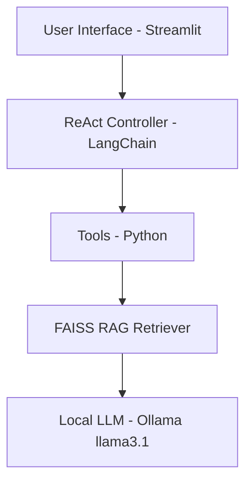

# 🩺 MedicoAgent — ReAct RAG Clinical Assistant (Ollama + FAISS + LangChain)


---

## 🧠 Overview
**MedicoAgent** is an educational AI clinical assistant built using **Streamlit**, **LangChain**, **FAISS**, and **Ollama (Llama3.1)**.

It operates on a **ReAct (Reason + Act)** pipeline — combining **retrieval-augmented generation (RAG)** with **tool usage** for physiological calculations such as:
- Body Mass Index (BMI)
- Mean Arterial Pressure (MAP)
- Anion Gap

> ⚠️ **Disclaimer:**  
> This system is for **educational and research use only.** It does **not provide medical advice, diagnosis, or treatment.**

---

## ⚙️ Features

| Feature | Description |
|----------|--------------|
| 🧩 **RAG Integration** | FAISS-based local retrieval from structured corpus |
| 🧮 **Medical Tools** | Built-in BMI, MAP, and Anion Gap calculators |
| 🧠 **Local LLM Support** | Uses Ollama with Llama3.1 (can replace with local or cloud models) |
| 💬 **ReAct Reasoning** | Multi-step reasoning with tool usage and context retrieval |
| 🎨 **Custom UI** | Dark mode Streamlit app with ChatGPT-style centered layout |
| 🧾 **Safety Layer** | Built-in educational disclaimer and structured system prompts |

---

## 🏗️ Architecture


---

### **3️⃣ Optional: Use Mermaid**
GitHub supports Mermaid for diagrams, which looks nicer and scales better:


## 🧰 Installation
1️⃣ **Create and Activate Virtual Environment**
```bash 
conda create -n medicoagent python=3.10 -y
conda activate medicoagent
```
2️⃣ **Install Dependencies**
```bash

pip install -r requirements.txt

```
3️⃣**Create and Activate Virtual Environment**
```bash
conda create -n medicoagent python=3.10 -y
conda activate medicoagent
```
4️⃣  **Install Dependencies**
```bash
pip install -r requirements.txt
Example requirements.txt:
streamlit
langchain
langchain-community
langchain-huggingface
faiss-cpu
pydantic
requests
python-dotenv
```
5️⃣ **Setup .env File**
```bash
Create a .env file in the project root:
LANGSMITH_API_KEY=your_langsmith_api_key
```
6️⃣ **Run Ollama (for Local LLM)**
```bash
Download Ollama and pull the model:
ollama pull llama3.1
Then start Ollama in the background (default port 11434)
```
##🚀 **Run the Streamlit App**
```bash 
streamlit run app.py
Open http://localhost:8501 in your browser.
```

##🧪 **Example Queries**
```bash
“A patient has SBP 120 mmHg and DBP 80 mmHg. Calculate MAP.”
“If sodium is 140, chloride 104, and bicarbonate 24, what’s the anion gap?”
“Explain tissue hypoxia and its effects.”
```
##📊 **Output Format (Structured)**
```bash
Red Flags: Immediate clinical alerts.
Key Missing Questions: Up to 4 clarifications.
Calculated Parameters: (e.g., BMI, MAP).
Hypotheses (Educational Only): Possible conditions.
Next-Step Considerations: Learning takeaways.
Citations: Corpus references.
Safety Note: Educational disclaimer.
```


